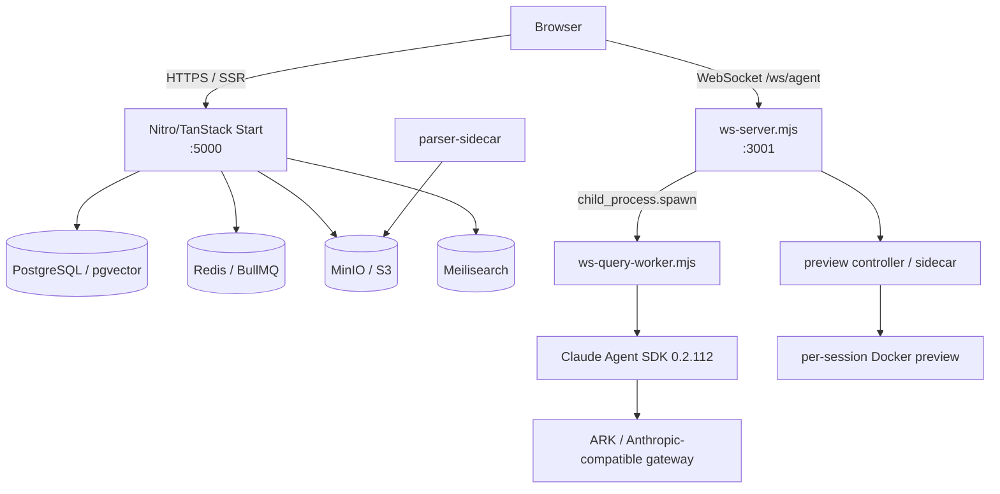
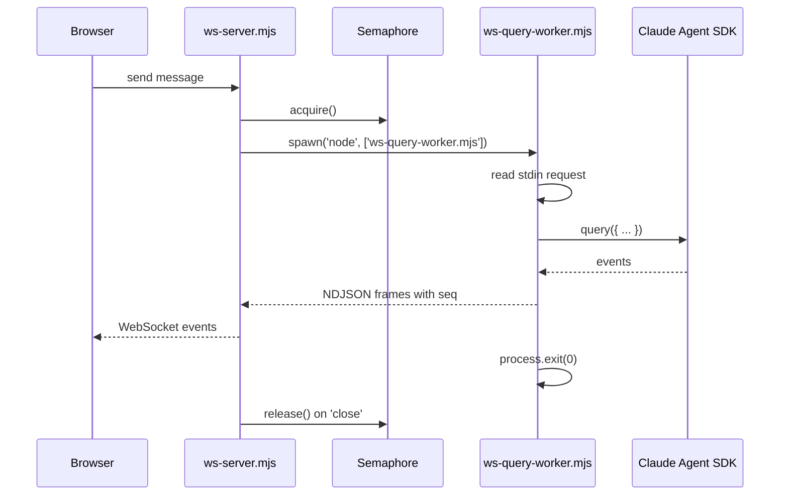
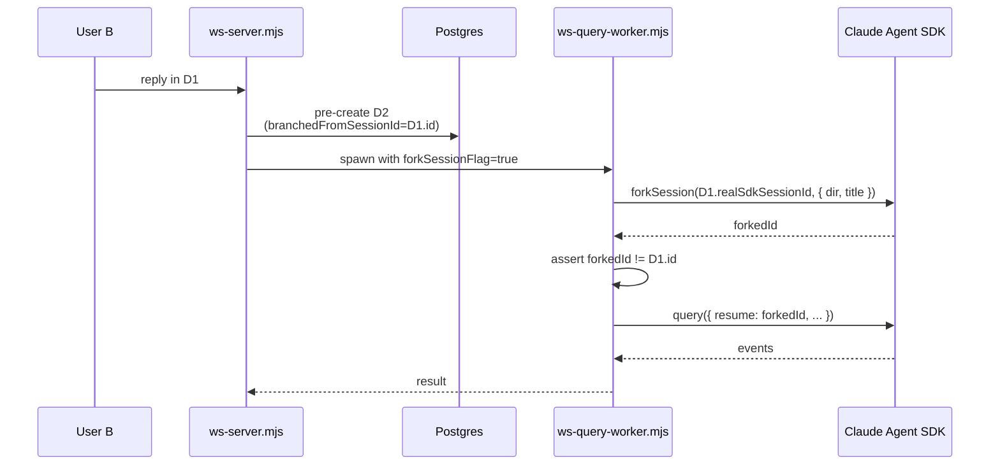

# Kin 架构全景

> 本文档是 Kin 的单一架构真相源。它描述项目的定位、物理拓扑、核心子系统、关键设计决策、已交付状态以及长期架构张力。
>
> 最后更新：2026-06-30

---

## 1. 定位与身份

**Kin** 是一个自托管、单组织、多用户的 Claude Agent 工作台。

> 核心命题：不自写 Agent Loop，而是把 Claude Agent SDK 的 `query()` 包进一个完整的工程 harness，让其在安全、持久、并发、可扩展、可部署的真实团队环境中运行。

- **目标用户**：小型可信团队（semi-trusted colleagues）。
- **威胁模型**：同事之间半可信，不是匿名互联网攻击者。因此强大的代码执行是核心功能，而不是被禁止的功能。
- **部署目标**：一台 16 GB / 8-core VPS，约 50 并发会话。
- **模型接入**：通过 ARK（火山）等多模型网关走 Anthropic-compatible 协议；Claude Agent SDK 精确锁定 **0.2.112**。

关键外部约束：

- 必须自托管（数据不出境、可接私有模型网关）。
- 必须多用户协作。
- 必须执行任意代码（Python/Bash）和生成多文件 App 预览。
- 必须可观测、可上线、可维护。

---

## 2. 四角进程拓扑



四个角的职责：

| 进程 | 文件 | 职责 |
|---|---|---|
| **SSR 主站** | `start-production.mjs` + Nitro/TanStack Start | 页面、API、Auth、DB、设置、Admin |
| **WebSocket 服务器** | `ws-server.mjs` | 连接管理、会话生命周期、worker 调度、预览控制 |
| **per-message worker** | `ws-query-worker.mjs` | 每条用户消息一个子进程，实际调用 SDK `query()` |
| **预览 sidecar** | `src/preview/controller.mjs` | per-session Docker 预览环境管理 |

---

## 3. 执行模型：per-message worker

**核心决策**：每条用户消息 spawn 一个 Node 子进程，跑完 `result` 事件即退出。



默认并发限制：

| 参数 | 默认值 | 含义 |
|---|---|---|
| `MAX_CONCURRENT_WORKERS` | 8 | 全局同时运行的 worker 数 |
| `PER_USER_MAX_WORKERS` | 3 | 每用户同时运行 worker 数 |
| `WORKER_MAX_OLD_SPACE_MB` | 1536 | 每个 worker 堆内存上限 |

为什么不是常驻 worker：

- 隔离：一个用户的 runaway 工具只能 kill 自己的 worker。
- 可中断：直接 `worker.kill()` 即可清理。
- 状态干净：进程退出，无跨消息污染。
- 预算可控：8 × 1.5 GB ≈ 12 GB，16 GB 主机留有余量。

**关键实现**：槽位必须在 `worker.on('close')` 里释放，而不是在收到 `result` 时释放。

---

## 4. 流式协议：NDJSON + seq + 背压

- Worker 与 ws-server 之间用 **NDJSON**（newline-delimited JSON）通信。
- 每帧带单调递增 `seq`，前端按 `seq` 合并，解决乱序和重影。
- WebSocket 背压：当 `ws.bufferedAmount > 128 KB` 时暂停 `worker.stdout`，低于 32 KB 时恢复。
- Text 增量按 100 ms 批量，其他事件立即转发。

这种设计利用 OS pipe 的背压，避免在应用层引入无界队列。

---

## 5. 安全模型：三层隔离

### 5.1 路径安全（逻辑层）

`src/claude/path-security.js` 在工具调用执行前检查：

- 系统前缀封锁：`/etc`, `/proc`, `/sys`, `/root`, `/var`, `/bin`, `/usr`, `/sbin`, `/boot`, `/lib`。
- 跨用户硬拒绝：路径在 `sessionsRoot` 下但不在当前用户 `userRoot` 下 → deny。
- 写范围：当前 workspace + 用户所有 sessions。
- 读范围：当前 workspace、用户 sessions root、`/app`（只读）、skills 目录。
- 先 `realpath` 解析 symlink，再判断边界。

### 5.2 执行沙箱（物理层）

`ExecutionRuntime` 双后端：

- `LocalProcessBackend`：Linux 用 srt（bubblewrap）+ `prlimit`；macOS 关闭 srt（需 `EXEC_RUNTIME=docker`）。
- `DockerBackend`：每个命令起一个锁死容器，`--network none`、`--read-only`、`--cap-drop ALL`。

**FAIL-CLOSED**：沙箱未就绪则拒绝执行，绝不降级到裸主机。

`buildSafeEnv()` 无条件剥离 `ANTHROPIC_API_KEY` 等 secrets，无论沙箱是否激活。

### 5.3 权限与 HITL

- **Ask** 模式：每个 action tool 暂停，等待用户批准（SDK `permissionMode: 'default'`）。
- **Act** 模式：自动执行（SDK `permissionMode: 'acceptEdits'`）。
- 默认 `act`。
- 原生 `Bash` 工具永久禁用，只能通过 `mcp__bash__run` 调用。
- 批准通过 stdin/stdout 往返实现：worker 发出 `approval_request`，浏览器回复 `approval_response`。

---

## 6. 工具与扩展

### 6.1 SDK preset

`claude_code` preset 提供 Read/Write/Edit/Grep/Glob/Ls 等，路径边界由 `path-security.js` 额外加固。

### 6.2 自定义 MCP

| 工具 | 说明 |
|---|---|
| Python | 通过 `ExecutionRuntime` 运行 |
| Bash | `mcp__bash__run`，沙箱就绪才注册 |
| GLM-Image | 生成图片 |
| `kb_search` | RAG 检索 |
| OCR | 扫描文档 |

### 6.3 MCP 能力中心

- 7 个内置 MCP 在 `src/mcp-store/`。
- 启用状态：`~/.claude/mcp/enabled.json`。
- 凭据：`~/.claude/mcp/credentials.json`（`${VAR}` 模板替换）。
- 覆写：`~/.claude/mcp/overrides.json`。

### 6.4 Skills 系统

- Skill = `SKILL.md` + 可选 schema/模板。
- copy-on-enable：从 store 拷贝到 `~/.claude/skills/<slug>/`。
- disabled veto：用户禁用后，平台同步不会重新启用。
- schema 通过 LLM Structured Outputs 懒生成，存 `.schema.json` + `.schema.meta.json`。
- 运行时注入 system prompt。

---

## 7. Project 协作与 branch-on-reply

Project 是 Kin 的一等协作容器。

### 7.1 数据模型

```typescript
// project
id, ownerUserId, name, description, instructions, isDefault

// project_member
projectId, userId, role ('owner' | 'member')

// agent_session
userId, projectId, branchedFromSessionId, sdkSessionId, realSdkSessionId, claudeHomePath
```

- `projectId = null` → personal / loose 会话，仅自己可见。
- `projectId != null` → 项目成员可见。
- `branchedFromSessionId != null` → 该会话是分支。
- 每个用户自动创建默认 `个人/Personal` 项目。

### 7.2 单一 access resolver

> **"never scatter `WHERE user_id`"**

所有可见性检查都走 `src/server/projects/access.ts`：

- `accessibleProjectIds(userId)`
- `visibleSessionsWhere(userId, accessibleIds)`
- `canAccessSession(userId, session)`
- `isSessionMutable(userId, session)`：只有 `userId` 才能修改/删除/收藏
- 同样规则延伸到 documents 和 knowledge bases。

### 7.3 共享机制

- 分享项目 = owner 通过邮箱添加成员（`addProjectMember`）。
- 成员 instantly 看到项目内所有会话、文档、KB。
- 删除项目时，项目内会话 `projectId` set null，变成 loose，不删除。

### 7.4 branch-on-reply（续聊即分支）

当非 owner 在项目共享会话 D1 中回复时：



- 用 SDK 的 standalone `forkSession()` 本地 fork，不依赖 ARK。
- 不用 `query({ forkSession: true })`，因为流式模式下 SDK 可能在 fork 前把 prompt 写进源 JSONL。
- D2 继续使用 D1 的工作区作为 `cwd`，保证文件/Artifact 可见。
- 原会话 D1 完全只读，不变。

UI 组件：

- `src/components/projects/share-project-dialog.tsx`
- `src/components/projects/project-menu.tsx`
- `src/lib/hooks/use-session-branch-info.ts`

---

## 8. 会话持久化

- SDK 把每次对话写成 JSONL transcript：`/data/users/{userId}/sessions/{sessionId}/workspace/.claude/projects/{hash}/{sdkSessionId}.jsonl`。
- 数据库只存索引：`agent_session.sdkSessionId`、`realSdkSessionId`、`claudeHomePath`、`projectId`、`branchedFromSessionId`。
- resume 时从 transcript 加载历史。
- `claudeHomePath` 必须是绝对路径（相对路径会导致 worker 和 ws-server 解析不同，resume 失败）。

**已知张力**：transcript 是 SDK 内部产物，格式/路径不由 Kin 控制。长期计划是让 DB 成为消息真相，transcript 作为缓存。

---

## 9. 单组织多用户隔离

- 每个用户 `CLAUDE_HOME`：`/data/users/{userId}`。
- 每个会话 workspace：`/data/users/{userId}/sessions/{sessionId}/workspace`。
- 逻辑层路径守卫先于物理沙箱。
- 威胁模型：半可信同事，而非匿名攻击者。
- Project 在路径隔离之上增加了成员关系层。

---

## 10. 并发与资源预算

- 全局 worker 信号量：8。
- 每用户 worker 闸：3。
- 每个 worker 堆上限：1.5 GB。
- 空闲 reaper 默认关闭。
- 文本批处理：100 ms。
- WebSocket 背压：128 KB / 32 KB。

50 并发会话 ≠ 50 并发执行。大多数会话空闲，实际执行 ≤ 8。

---

## 11. 多模型路由

- SDK 通过 ARK 网关走 Anthropic-compatible 协议。
- 必须只设 `ANTHROPIC_AUTH_TOKEN`，不能设 `ANTHROPIC_API_KEY`（后者会改用 x-api-key，ARK 拒绝）。
- 模型别名：`ANTHROPIC_MODEL`、`DEFAULT_SONNET_MODEL`、`DEFAULT_OPUS_MODEL`、`DEFAULT_HAIKU_MODEL` 等。
- SDK 版本精确锁定 `0.2.112`（无 `^`/`~`）。
- MVP 多模型选择已交付：DB 注册表、6h 健康探测、模型选择器、`/admin/models` CRUD、per-request worker-env 路由。

---

## 12. RAG / 文档 / OCR

### 12.1 RAG

RAG 已整条落地上生产，是 Agentic RAG：

- 检索不是 prompt 前处理，而是 Agent 可调的工具 `kb_search`。
- 离线：PDF → parser sidecar → 结构切块 → embedding → pgvector。
- 在线：pgvector 向量召回 ∥ Meili BM25 → RRF 融合 → 可选 rerank → small-to-big 回取 parent。
- 维度：1024（doubao-embedding-vision）。
- 隔离：SQL 层 `WHERE userId = ? AND kbId IN (...)`。
- 检索结果包在 `<retrieved-passages>` 信封，带页码引用。
- 每次 `kb_search` 落 `rag_search_trace` 表。

评估驱动的关键决策：

- rerank 默认关闭（`k=8` 时收益不明显，且增加 ~1.4s）。
- 不做 HyDE/query 改写：Agent 自己迭代调用 `kb_search`。

### 12.2 文档解析

- `parser-sidecar/`：Java 侧车，专门解析 PDF 并产出 pageMap，供页码引用。
- markitdown 作为兜底。
- 大文件（2.4 MB 年报）有 parse/render 超时处理。

### 12.3 OCR

已交付模块 `/agents/ocr`：

- 懒加载缩略图导航
- 页状态 badge
- 大文件超时
- reopen 恢复原始文件和完整页集
- 显式错误回传

---

## 13. Artifacts 与真预览

### 13.1 Artifacts

- 启发式检测 AI 输出中的文件。
- structured outputs 默认关闭（SDK stop-hook 会污染上下文）。
- 每回合收敛成一张 Artifact 卡。

### 13.2 真预览

- per-session Docker 容器。
- 四段管线：manifest 检测 → build-first → Traefik 子域反代 → bootstrap JWT → cookie 鉴权。
- `MAX_ACTIVE_PREVIEWS=4`，idle 5-10 分钟回收。
- 子域 `<previewId>.oxygenie.cc`，Cloudflare Origin CA 一次签发复用。
- iframe 用 `sandbox="allow-scripts allow-forms allow-downloads"`，无 `allow-same-origin`。

**架构张力**：agent 在 per-message worker 执行，preview 在 per-session Docker 运行，两套生命周期共享 workspace。统一运行时是长期债务。

---

## 14. 计费与可观测

### 14.1 计费

- `usage_record` 是只读账本，记录 tokens。
- `costUsd` 仅供参考，不用于扣费。
- 计费表已就位：`plans`、`subscriptions`、`credit_balances`、`credit_ledger`、`invoices`。
- Polar webhook 接入。
- 当前未调用 `spendOneCredit`，无配额强制 gate。

### 14.2 可观测三件套

- **PostHog**：行为事件，`sessionId` 截前 8 位。
- **Sentry**：前后端错误。
- **`audit_log`**：append-only 安全审计，`userId` 非外键（用户删除后审计仍保留）。

---

## 15. 部署模型

- 多阶段 Dockerfile，builder 8 GB，runner ~1.5 GB。
- GitHub Actions amd64 预构建 → GHCR。
- Dokploy + Docker Compose 单文件拉起：Traefik、Postgres、Redis、MinIO、Meili、app、ws-server、migrate、worker、preview-controller。
- Traefik 子域反代，Cloudflare Origin CA 证书。
- `docker-compose.dokploy.yml` 中 app 镜像必须 `pull_policy: always`。
- 本地开发用 `scripts/local-prod.sh --build`；`pnpm dev` 当前不可用。

---

## 16. 前端与状态

- TanStack Start + React + shadcn/ui + Assistant UI。
- `src/claude/adapters/ws-adapter.ts` 实现 Assistant UI 的 `ChatModelAdapter`。
- 并发会话：会话级路由、后台续跑、running sessions 轮询、approval_request 仅对当前 viewing session 弹窗。
- Workbench：Progress / Sub-agents / Files / Context 四面板，已读真实 FS。

---

## 17. 已交付功能时间线

| 时间 | 功能 |
|---|---|
| 2026-05 | 基础执行、安全、会话持久化 |
| 2026-06-04 | Skills 集成 S1-S4、Ask/Act HITL |
| 2026-06-06 | Phase C 真预览、三种部署路径 |
| 2026-06-07 | MVP 多模型选择 |
| 2026-06 | Projects P1 + branch-on-reply |
| 2026-06-30 | OCR、Workbench 硬ening、权限后台、上传链路修复、品牌 Kin 对齐 |

---

## 18. 架构张力与长期债务

| 张力 | 现状 | 方向 |
|---|---|---|
| per-message worker vs per-session preview | 两套运行时共享 workspace | 统一运行时 |
| transcript 为真相 | resume 脆弱 | DB 为真相，transcript 为缓存 |
| Skills copy-on-enable | 磁盘线性增长 | DB catalog + 懒加载 |
| 前端 seq 排序 | 协议有 seq，store 未完全按 seq 合并 | 统一排序键 |
| SDK 0.2.112 锁定 | 绑定 ARK | 预留迁移到原生 Anthropic + native binary |
| 计费 | 只观测不扣费 | 校准 token→credit 后接 gate |
| 长期记忆 | 未实现 | 两层记忆 + LLM 蒸馏 |
| 上下文工程 | 未实现 | offload-first 渐进压缩 |
| project.instructions | 已存储但未接入系统提示 | 自动注入 |
| branch 源删除后 | D2 可能丢失 workspace 引用 | 明确边界策略 |

---

## 19. 最关键的技术亮点

1. 用操作系统进程边界作为 Agent 隔离原语。
2. 把 Claude Agent SDK 的 `query()` 放进一次性子进程，让并发、隔离、中断都变得简单。
3. NDJSON + seq 的流式协议，用 OS pipe 背压解决快慢消费者问题。
4. FAIL-CLOSED 沙箱模型：拒绝执行，而不是降级到裸主机。
5. ARK 多模型借壳 Anthropic 协议：一个 SDK 兼容多个模型，代价是版本锁定。
6. Agentic RAG：检索是 Agent 可调的工具，不是 prompt 前处理。
7. 真预览是微型 PaaS：不是 iframe，而是 per-session Docker + 子域 + JWT/cookie。
8. Project + branch-on-reply：共享只读上下文，私有续写分支，避免多写锁。
9. 观测优先计费：先诚实记录 tokens，再决定怎么收钱。

---

## 20. 文档索引

- 详细状态与路线图：`docs/project/STATUS.md`、`docs/project/ROADMAP.md`
- 开发规则与约束：`CLAUDE.md`
- 工程化拆解 lessons：`docs/blog/reading-map.md` 与 `docs/blog/zh/`
- 部署指南：`docs/deployment/`
